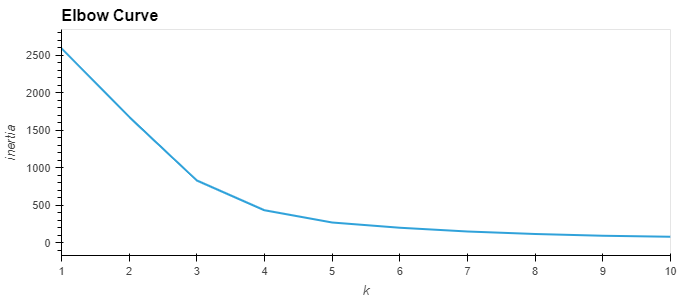
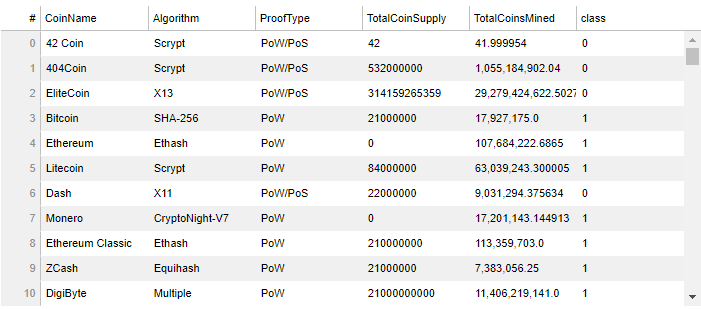
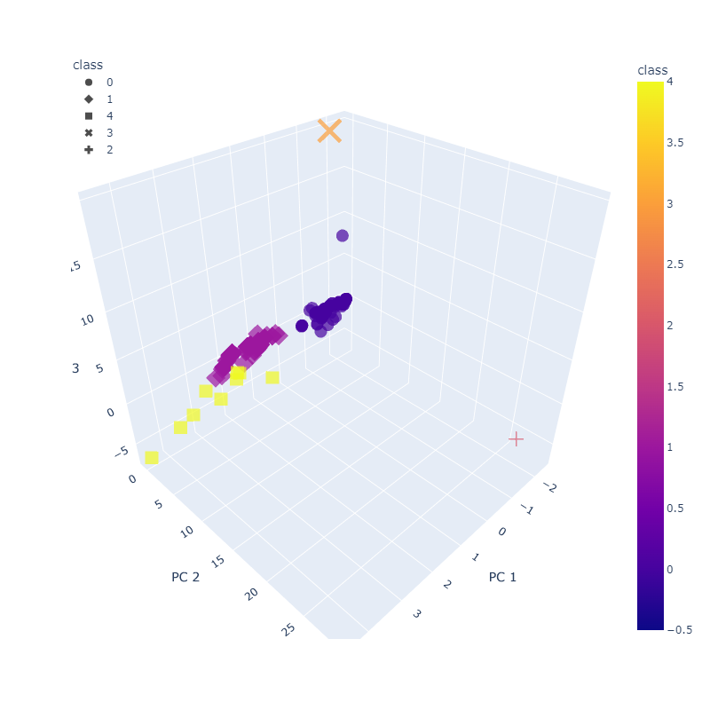
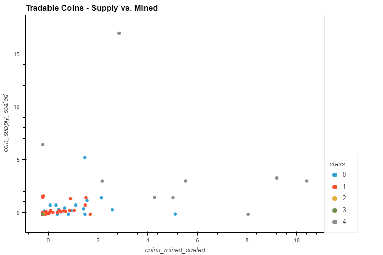

# Clustering Cryptos
This goal of this code is to use the list of all cryptocurrencies to analyze which are available on the trading market and how they can be grouped using classification. The results of the analysis are presented in plots and a table.

---

First, the code preprocesses data from all coins available at CryptoCompare.com (data downloaded into a spreadsheet from the website). The data on the coins was first cleaned and sorted - coins that have at least 1 coin mined, are tradable, and have an algorithm which in some form is Proof of Work (PoW) were used. 

Onced preprocessed, the data was clustered to create classes for analysis using the Principal Component Analysis (PCA) algorithm and K-Means. Three components were used for PCA. The ideal number of clusters chosen here was 5 based on the plotted elbow curve, as shown below.

Data from the cluster analysis was saved in a dataframe and then presented in an hvplot table, as shown below.

---

## Visualizations
Visualizations of the clustered data were then created, as shown below. The 3D scatter plot shows the clusters predicted based on the pre-processed data. When this plot is live, hovering over each data point displays the coin's name and algorithm.

The 2D scatter plot shows the different clusters of coins based on the total supply of the coin versus the total number of mined coins. Hovering over the data points in the live plot displays the coin name. 

